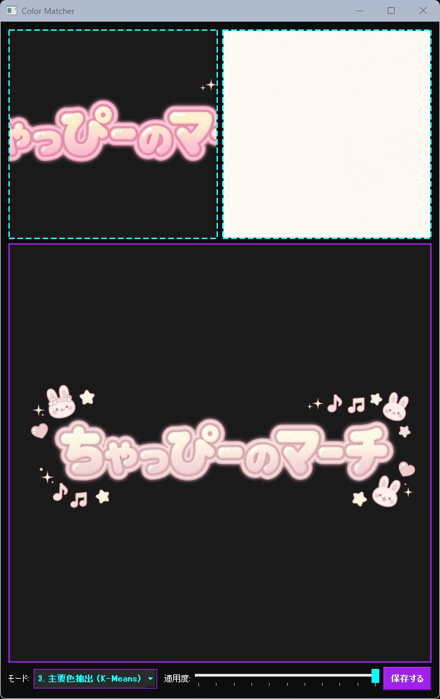
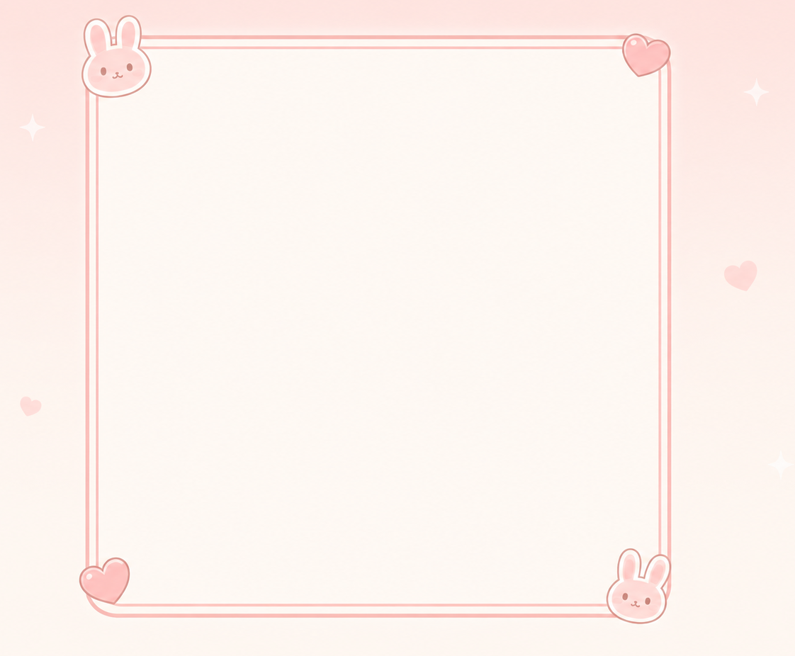
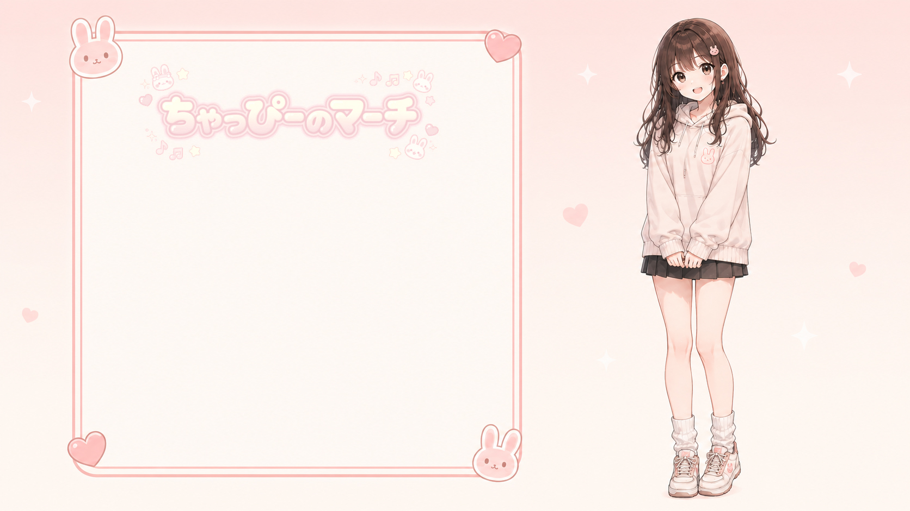

# Color Matcher

## 機能概要

元画像の色調を参考画像に自動でマッチングし、透過PNG対応で自然に recolor できるPyQt5製GUIツールです。

### 主な機能

- 元画像（透過PNG対応）と色参考画像をドラッグ＆ドロップで読み込み
- 4種類のカラーマッチングアルゴリズムで色調を自動変換

    1\. 標準（全体平均）
    2\. 白黒除外（輝度マスク）
    3\. 主要色抽出（K-Means）
    4\. ヒストグラムマッチング

- 適用度スライダーで元画像と変換結果をリアルタイムにブレンド
- LAB色空間を使った自然な色変換＋アルファチャンネル保持
- 日本語パス完全対応で即座に透過PNGとして保存

### 一言で言うと

「Color Matcher（色調自動マッチングツール）」

## 使い方

1. **アプリを起動する**

    ターミナルで`python color-matcher.py`を実行（事前に`pip install PyQt5 opencv-python numpy`を済ませておけよ）。

2. **元画像をドロップ**

    左側のエリアに色を変えたい画像（透過PNG推奨）をドラッグ＆ドロップ。

3. **色参考画像をドロップ**

    右側のエリアに参考にしたい色調の画像をドラッグ＆ドロップ。

4. **モードと適用度を調整**

    「モード」コンボボックスでアルゴリズムを選択（デフォルトは「白黒除外」）

    「適用度」スライダーで変換の強さを0～100%で調整（リアルタイムで中央プレビューが更新される）

5. **保存する**

    「保存する」ボタンをクリック。カレントフォルダに`recolor-YYYYMMDDHHMMSS.png`として透過PNGが保存される。

## 必要環境

- Python 3.10以上
- 必要なライブラリはソースコードの先頭に書いてあります。

## 実行テスト

**元画像**

**色参考画像**

**変換後画像**

**合成画像**

## ライセンス

**MIT License** で公開しています。  
ご自由に使って、改変して、参考にしてください。  
ただし**自作発言はNG**でお願いします。
